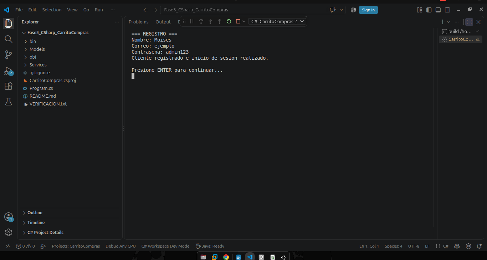
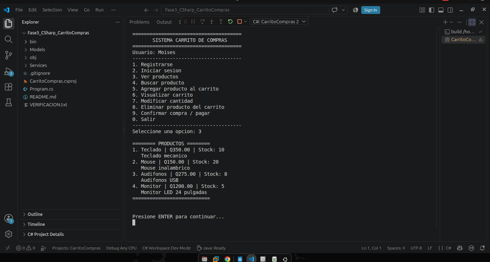
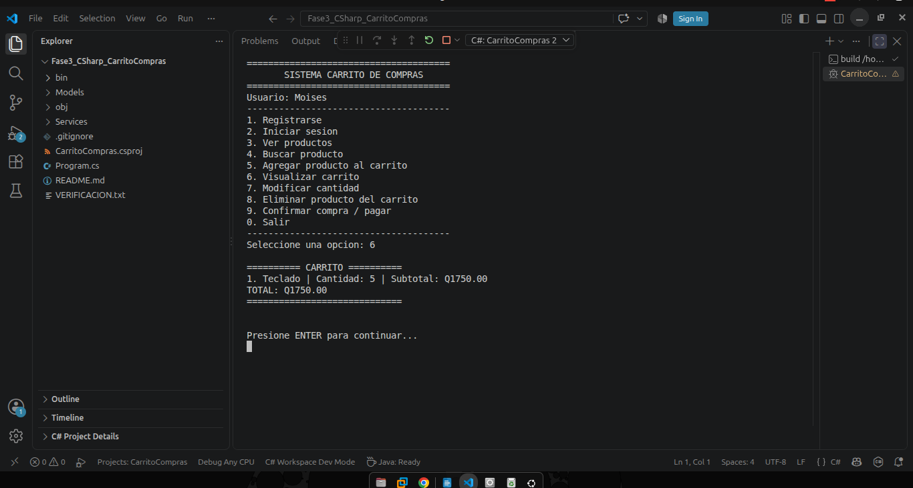
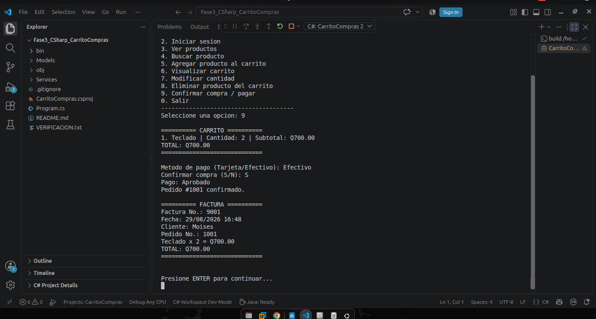

# Carrito de Compras

El sistema simula el proceso de compra de un cliente, desde el registro e inicio de
sesión hasta la administración del carrito, pago y generación de
factura.

------------------------------------------------------------------------

## Fase 1 --- Modelado lógico

En esta fase se definió el flujo del sistema, sus reglas principales y
las acciones disponibles para el cliente.

### Diagrama de flujo general

El proyecto incluye ocho diagramas de flujo que representan las
diferentes etapas del proceso de compra.

[Ver todos los diagramas de flujo](01-Fase1-Modelado/Diagramas-Flujo/)

Los archivos `.drawio` se incluyen como versiones editables de los
diagramas.

### Diagrama de casos de uso

[Ver archivo editable del diagrama de casos de
uso](01-Fase1-Modelado/Casos-de-Uso/Casos_de_Uso_Carrito_Compras.drawio)

------------------------------------------------------------------------

## Fase 2 --- Programación Orientada a Objetos con BlueJ

En esta fase se trasladó el diseño lógico a una estructura de clases y
objetos.

Las clases principales son `Cliente`, `Producto`, `Inventario`,
`Carrito`, `DetalleCarrito`, `Pedido`, `Pago` y `Factura`.

### Diagrama de clases

[Ver archivo editable del diagrama de
clases](02-Fase2-POO-BlueJ/Diagrama-Clases/Diagrama_de_Clases_Carrito_Compras.drawio)

[Ver proyecto BlueJ](02-Fase2-POO-BlueJ/Proyecto-BlueJ/)

------------------------------------------------------------------------

## Fase 3 --- Implementación en C

El programa permite registrar usuarios, iniciar sesión, consultar
productos y existencias, agregar productos al carrito, modificar
cantidades, eliminar productos, calcular el total, confirmar la compra,
simular el pago y generar una factura.

### Evidencias de funcionamiento

#### Registro de usuario

#### Productos disponibles

#### Carrito de compras

#### Factura

Las pruebas adicionales de inicio de sesión, agregar producto, modificar
cantidad y eliminar producto se encuentran en la carpeta de evidencias.

[Ver todas las evidencias](05-Evidencias/)

