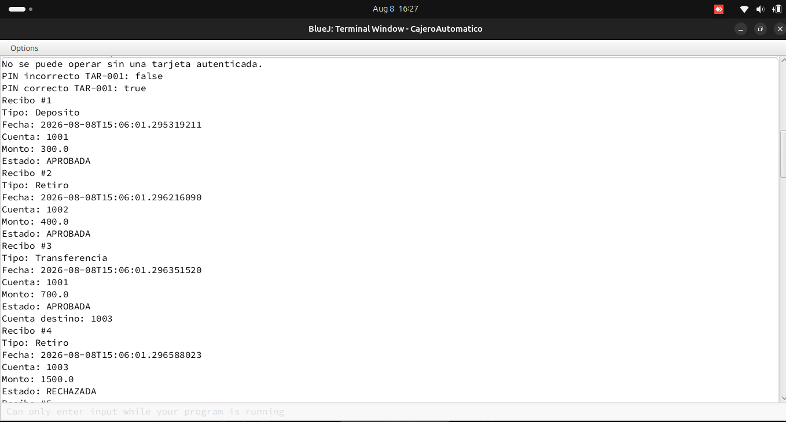
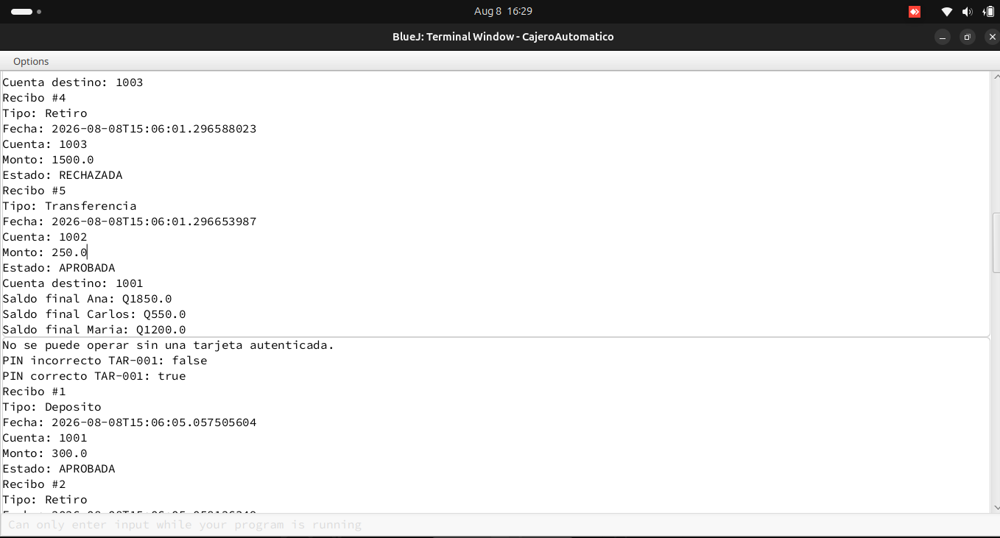
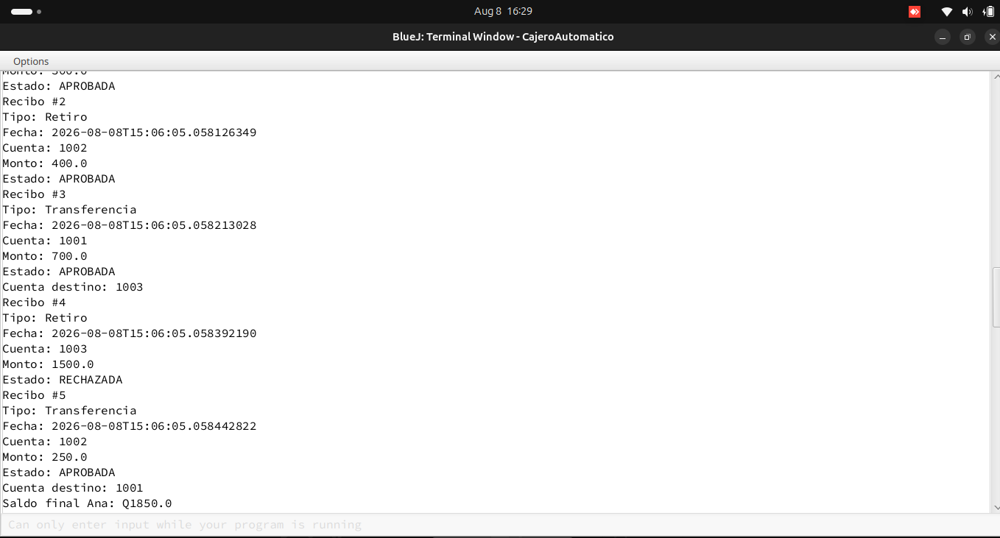

# 🏦 Simulador Bancario — Simulador2


## 📌 Descripción

`Simulador2` es una nueva clase que utiliza las clases que ya existían en el proyecto para crear un escenario bancario con varios clientes, cuentas y tarjetas.

No modifica el funcionamiento de las clases originales; utiliza sus objetos y métodos para realizar nuevas operaciones y pruebas.

---

## 🏛️ Banco Universitario

Se crea un nuevo objeto de la clase `Banco`:

```java
Banco objBanco = new Banco("Banco Universitario");
```

El objeto `objBanco` representa el banco que se utilizará durante toda la simulación.

---

## 👥 Clientes

Se crean tres clientes:

```java
Cliente objAna = new Cliente("Ana Lopez", "001");
Cliente objCarlos = new Cliente("Carlos Perez", "002");
Cliente objMaria = new Cliente("Maria Gomez", "003");
```

Cada objeto representa a un cliente diferente dentro del sistema.

| Cliente | Documento |
|---|---|
| 👩 Ana López | 001 |
| 👨 Carlos Pérez | 002 |
| 👩 María Gómez | 003 |

---

## 💰 Cuentas bancarias

Se crea una cuenta para cada cliente:

```java
CuentaBancaria objCuentaAna =
    new CuentaBancaria("1001", objAna, 2000.00);

CuentaBancaria objCuentaCarlos =
    new CuentaBancaria("1002", objCarlos, 1200.00);

CuentaBancaria objCuentaMaria =
    new CuentaBancaria("1003", objMaria, 500.00);
```

Cada cuenta recibe su número, el objeto `Cliente` que será su titular y el saldo inicial.

| Cuenta | Titular | Saldo inicial |
|---|---|---:|
| `1001` | Ana López | Q2,000.00 |
| `1002` | Carlos Pérez | Q1,200.00 |
| `1003` | María Gómez | Q500.00 |

Después, las cuentas son registradas en el banco:

```java
objBanco.registrarCuenta(objCuentaAna);
objBanco.registrarCuenta(objCuentaCarlos);
objBanco.registrarCuenta(objCuentaMaria);
```

---

## 💳 Tarjetas

Se crea una tarjeta asociada a cada cuenta bancaria:

```java
Tarjeta objTarjetaAna =
    new Tarjeta("TAR-001", "1234", objCuentaAna);

Tarjeta objTarjetaCarlos =
    new Tarjeta("TAR-002", "2345", objCuentaCarlos);

Tarjeta objTarjetaMaria =
    new Tarjeta("TAR-003", "3456", objCuentaMaria);
```

| Tarjeta | PIN | Cuenta |
|---|---|---|
| `TAR-001` | `1234` | 1001 |
| `TAR-002` | `2345` | 1002 |
| `TAR-003` | `3456` | 1003 |

Las tarjetas son registradas en el banco:

```java
objBanco.registrarTarjeta(objTarjetaAna);
objBanco.registrarTarjeta(objTarjetaCarlos);
objBanco.registrarTarjeta(objTarjetaMaria);
```

---

## 🏧 Cajero automático

Se crea un cajero asociado al Banco Universitario:

```java
CajeroAutomatico objCajero =
    new CajeroAutomatico(objBanco);
```

Este objeto se utiliza para realizar las autenticaciones y operaciones bancarias.

---

## 🔐 Pruebas de autenticación

El programa comprueba que no sea posible realizar operaciones sin una tarjeta autenticada.

<details>
<summary>📖 Ver código de la prueba</summary>

```java
try {
    objCajero.consultarSaldo();
}
catch (IllegalStateException e) {
    System.out.println(
        "No se puede operar sin una tarjeta autenticada."
    );
}
```

</details>

También se prueba `TAR-001` primero con un PIN incorrecto y después con el PIN correcto:

```java
objCajero.autenticar("TAR-001", "9999");
objCajero.autenticar("TAR-001", "1234");
```

Esto permite comprobar que solamente sea posible operar cuando la autenticación sea correcta.

---

## 🔄 Operaciones realizadas

Las operaciones se ejecutan utilizando los métodos del cajero automático.

```java
objCajero.depositar(300.00);
objCajero.retirar(400.00);
objCajero.transferir("1003", 700.00);
objCajero.retirar(1500.00);
objCajero.transferir("1001", 250.00);
```

| # | Operación | Monto | Resultado |
|---:|---|---:|---|
| 1 | 💵 Depósito a Ana | Q300.00 | ✅ Exitoso |
| 2 | 💸 Retiro de Carlos | Q400.00 | ✅ Exitoso |
| 3 | 🔁 Ana → María | Q700.00 | ✅ Exitoso |
| 4 | 💸 Retiro de María | Q1,500.00 | ❌ Rechazado |
| 5 | 🔁 Carlos → Ana | Q250.00 | ✅ Exitoso |

El retiro de **Q1,500.00 de María** es rechazado porque el saldo disponible en su cuenta es menor al monto solicitado.

---

## 🔄 Cambio de tarjeta

Para trabajar con otra cuenta primero se cierra la sesión actual:

```java
objCajero.cerrarSesion();
```

Después se autentica la tarjeta del siguiente cliente:

```java
objCajero.autenticar("TAR-002", "2345");
```

De esta manera se puede cambiar de usuario sin modificar directamente las cuentas bancarias.

---

# 🧪 Evidencias de pruebas

## 📷 Prueba 1



---

## 📷 Prueba 2



---

## 📷 Prueba 3



---

## 📊 Saldos finales

Después de ejecutar todas las operaciones:

| Cliente | Saldo inicial | Saldo final |
|---|---:|---:|
| 👩 Ana López | Q2,000.00 | **Q1,850.00** |
| 👨 Carlos Pérez | Q1,200.00 | **Q550.00** |
| 👩 María Gómez | Q500.00 | **Q1,200.00** |

### ✅ Resultado

Los cambios de saldo se realizan mediante los métodos del cajero y las clases de transacción existentes.

**En ningún momento se modifica directamente el saldo de una cuenta.**

---

### 🛠️ Tecnologías utilizadas

- ☕ Java
- 🔵 BlueJ
- 🧩 Programación Orientada a Objetos
- 🌿 GitHub
