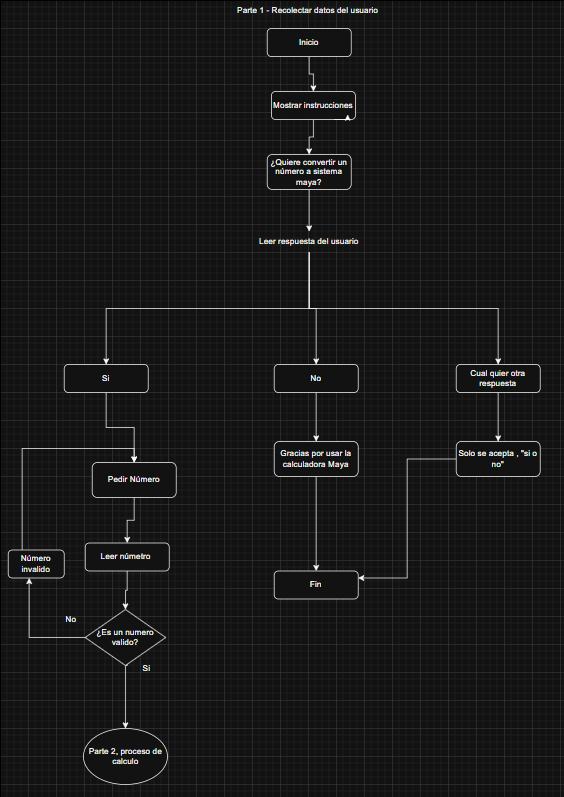
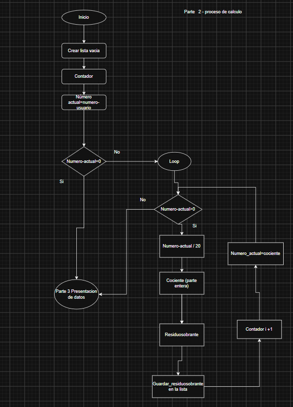
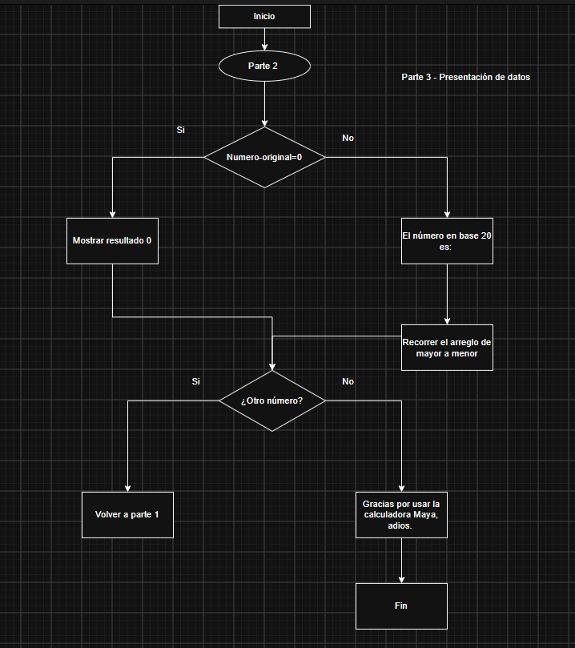

Nombre: Moisés Abinadí Farfan González
Programación 2
Sección A
Domingo

Calculadora Maya

Este programa permite la al usuario la conversion de de un numbero base 10 a sistema maya base 20. 

El programa fue divido en 3 partes: 

PARTE 1 - RECOLECCIÓN DE DATOS

En esta parte su función es la recopilacion de datos del usuario y validar que los mismos sean validos. 

Pseudocódigo parte 1
----------------------------------------------------------------------------------------------------------------------------------
Inicio

Preguntar al usuario si desea hacer la conversión de un número maya

Repetir hasta que el usuario escriba una respuesta válida:

    Si la respuesta es la palabra "si" en cualquier combinación de mayúsculas y minúsculas:
        Mostrar en pantalla las siguientes instrucciones:
            No se permite ingresar letras, el número no debe contener espacios ni símbolos
        Solicitar al usuario que ingrese un número
        Salir de la repetición

    Si la respuesta es la palabra "no" en cualquier combinación de mayúsculas y minúsculas:
        Mostrar en pantalla: Gracias por usar la calculadora Maya
        Terminar el programa

    Si la respuesta es cualquier otra cosa:
        Mostrar en pantalla: Solo se acepta Si o No
        Volver a preguntar

Fin de la repetición
--------------------------------------------------------------------------------------------------------------------------------------

Algoritmo parte 1 

--------------------------------------------------------------------------------------------------------------------------------------
---------------------------------------------
Código

#include <iostream>
using namespace std;

int main() {
   
    // Variables que necesitamos
    int numero;
    int numeroActual;
    int cociente;
    int sobrante;
    int residuos[20];
    int contador;
    int posicion;
    string respuesta;
   
    // PARTE 1 - Recoleccion de datos
   
    cout << "Desea convertir un numero a sistema maya base 20? (si/no): ";
    cin >> respuesta;
   
    // Si dice no, terminar
    if (respuesta == "no" || respuesta == "NO" || respuesta == "No" || respuesta == "nO") {
        cout << "Gracias por usar la calculadora Maya" << endl;
        return 0;
    }
   
    // Si dice cualquier otra cosa, mostrar error y terminar
    if (respuesta != "si" && respuesta != "SI" && respuesta != "Si" && respuesta != "sI") {
        cout << "Solo se acepta Si o No" << endl;
        return 0;
    }
   

----------------------------------------------------------------------------------------------------------------------------------------------------------------------------------------------------------------------------------------------------------------------------

Segunda Parte - Proceso de cálculo

En esta parte se realizan todos los calculos para convertir un número base 10 a sistema maya base 20

Inicio del proceso de calculo

    Crear una lista vacia para guardar los residuos
    Crear un contador y ponerlo en cero
    Tomar el numero que ingreso el usuario y llamarlo numero actual

    Si el numero actual es cero:
        Mostrar en pantalla: El resultado es cero
        Ir a la parte tres

    Si el numero actual no es cero:
        Repetir lo siguiente mientras el numero actual sea mayor que cero:
        
            Dividir el numero actual entre veinte
            El sobrante de esa division guardarlo en la lista de residuos en la posicion del contador
            Aumentar el contador en uno
            El numero actual ahora es el resultado entero de la division sin el sobrante
            
        Fin de la repeticion

Fin del proceso de calculo

--------------------------------------------------------------------------------------------------------------------------------------

Pseudocódigo

--------------------------------------------------------------------------------------------------------------------------------------
Código:

// PARTE 2 - Proceso de calculo
   
    contador = 0;
   
    // Tomar el numero del usuario y llamarlo numero actual
    numeroActual = numero;
   
    // Si el numero actual es cero
    if (numeroActual == 0) {
        cout << "El resultado es cero" << endl;
    }
   
    // Si el numero actual no es cero
    if (numeroActual != 0) {
       
        // Repetir mientras el numero actual sea mayor que cero
        while (numeroActual > 0) {
           
            // Dividir el numero actual entre veinte
            cociente = numeroActual / 20;
            sobrante = numeroActual % 20;
           
            // El sobrante guardarlo en la lista de residuos en la posicion del contador
            residuos[contador] = sobrante;
           
            // Aumentar el contador en uno
            contador = contador + 1;
           
            // El numero actual ahora es el resultado entero de la division sin el sobrante
            numeroActual = cociente;
           
        } 
       
    } 

------------------------------------------------------------------------------------------------------------------------------------------------------------------------------------------------------------------------------------------------------------------------------------------------------------------------------------------------------------------------------------------------------------------

Parte 3 - Presentación de datos

Esta parte se encarga de presentar los datos al usuario ordenadamente en sistema maya base 20

Pseudocódigo

Inicio de la presentacion de datos

    Si el numero no era cero:
    
        Mostrar en pantalla: El numero en base veinte maya es:
        
        Empezar desde la ultima posicion de la lista de residuos
        La ultima posicion es el contador menos uno
        
        Mientras no lleguemos a la primera posicion:
            Mostrar en pantalla el residuo que esta en esa posicion
            Dejar un espacio en blanco
            Pasar a la posicion anterior
        Fin del recorrido
        
        Mostrar en pantalla el ultimo residuo que falta
        Dar un salto de linea
        
    Fin de la condicion

    Mostrar en pantalla: Quiere convertir otro numero?
    
    Si la respuesta es si:
        Volver a la parte uno
        
    Si la respuesta es no:
        Mostrar en pantalla: Gracias por usar la calculadora Maya
        Terminar el programa
        
Fin de la presentacion de datos

--------------------------------------------------------------------------------------------------------------------------------------
Algoritmo

-------------------------------------------------------------------------------------------------------------------------------------

Código:

// PARTE 3 - Presentacion de datos
   
    // Si el numero no era cero
    if (numero != 0) {
       
        cout << "El numero en base veinte maya es: ";
       
        posicion = contador - 1;
       
        // Mientras no lleguemos a la primera posicion
        while (posicion >= 0) {
           
            // Mostrar en pantalla el residuo que esta en esa posicion
            cout << residuos[posicion] << " ";
           
            // Pasar a la posicion anterior
            posicion = posicion - 1;
           
        } 
       
        cout << endl;
       
    } 
   
    // Preguntar al usuario si quiere ingresar otro numero o terminar el programa
    cout << "Quiere convertir otro numero? (si/no): ";
    cin >> respuesta;
   
    if (respuesta == "si" || respuesta == "SI" || respuesta == "Si" || respuesta == "sI") {
        cout << "Reinicie el programa para convertir otro numero" << endl;
    }
    else {
        cout << "Gracias por usar la calculadora Maya" << endl;
    }
   
    return 0;
}

